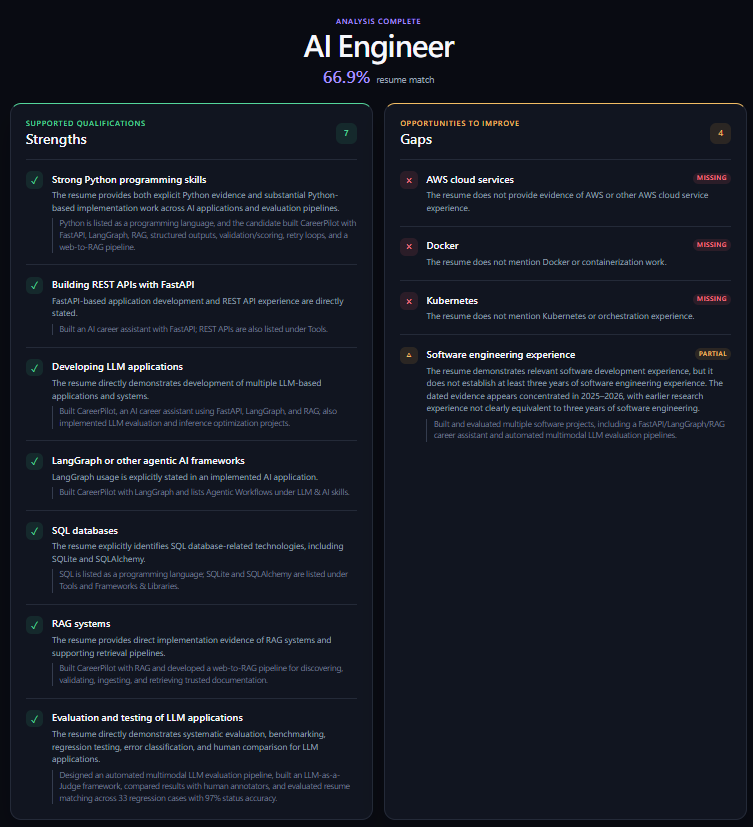
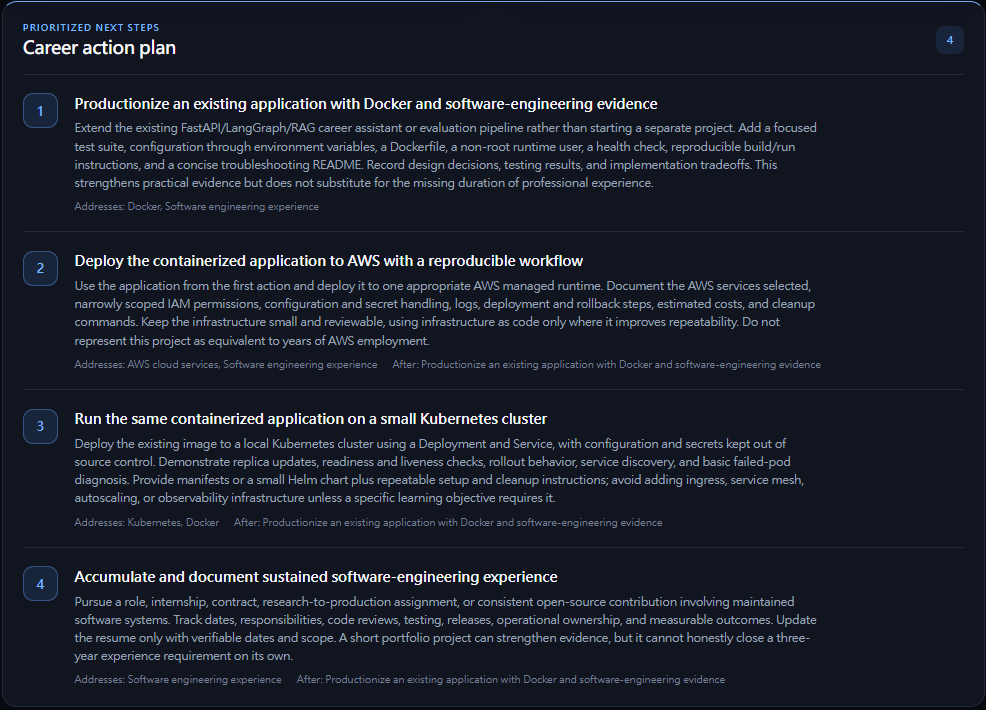
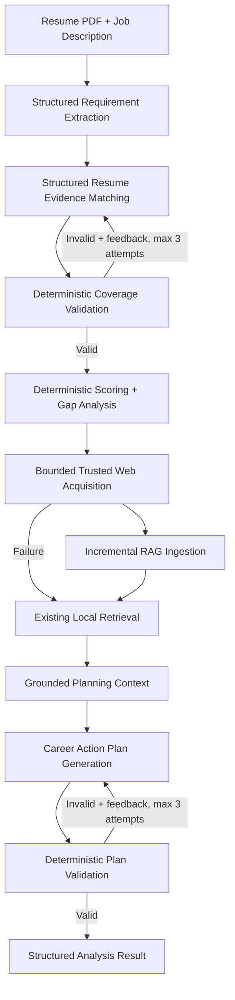

# CareerPilot

CareerPilot compares a PDF resume with a job description and turns the result into an evidence-based development plan. It extracts explicit requirements, matches resume evidence against every requirement, calculates a transparent score, identifies gaps, and generates a validated Career Action Plan.

The planner is grounded with a local retrieval-augmented generation (RAG) system. For supported gaps, CareerPilot can acquire approved official documentation through web search, persist it in the RAG store, retrieve relevant chunks, and use them as planning context. Retrieved knowledge can influence the action plan, but it never becomes resume evidence and never changes resume-match scoring.

- Structured LLM outputs with Pydantic
- Deterministic validation, scoring, and retry limits
- LangGraph-based matching and planning repair loops
- Incremental RAG ingestion and semantic retrieval
- Bounded, privacy-safe acquisition of trusted web knowledge

## Product preview

### Resume-to-job analysis

CareerPilot separates supported qualifications from gaps, labels requirements as matched, partial, or missing, and shows the resume evidence behind each decision alongside the deterministic match score.



### Career Action Plan

The identified gaps become prioritized, concrete next steps. Each action shows the qualifications it addresses and, where applicable, how it builds on earlier work.



## How it works



The LLM handles semantic interpretation and generation. Python owns rules that can be known exactly: requirement coverage, weighted scoring, plan validity, retry limits, web-acquisition limits, and trusted-source checks. LangGraph coordinates the matching and planning validation loops; web acquisition runs once before the planning graph, so plan repair retries do not repeat it.

Web acquisition is fail-open. Search, fetch, extraction, or ingestion failure does not prevent local retrieval or plan generation.

## Trusted web acquisition

CareerPilot does not browse autonomously or accept arbitrary web content. The implemented acquisition path is deterministic and deliberately conservative:

1. A `Gap` is converted into a privacy-safe query using only `Gap.area`.
2. Resume text, resume evidence, gap reason, candidate information, and the full job description are never sent to the search provider.
3. The provider-agnostic `WebSearchProvider` interface returns normalized `WebSearchResult` objects. Brave Search is the current concrete provider.
4. A small authority registry admits only explicitly approved official or primary documentation. Unknown or ambiguous authorities are rejected.
5. Candidate URLs are canonicalized and checked against the approved hostname and path policy.
6. The fetcher enforces HTTPS, redirect limits, public network destinations, timeouts, supported HTML/plain-text content types, and response-size limits.
7. Trafilatura extracts useful HTML content. Extracted HTML or plain text is normalized into a `NormalizedKnowledgeSource` with provenance timestamps and a content hash.
8. The normalized source is passed to the existing RAG ingestion boundary.

The current registry covers Docker, Kubernetes, Python, AWS, Azure, GitHub Actions, Terraform, and PostgreSQL documentation. It is intentionally high-precision and low-recall.

## RAG pipeline

CareerPilot supports both manifest-based manual knowledge and incrementally acquired web knowledge:

```text
NormalizedKnowledgeSource
→ deterministic heading-aware chunking with overlap
→ OpenAI embeddings
→ SQLite document/chunk storage
→ cosine-similarity Top-K retrieval
→ per-gap deduplication and context aggregation
→ Career Action Planner
```

Incremental ingestion identifies web documents by canonical URL. Re-ingesting the same URL and content hash returns an unchanged result and skips unnecessary chunking and embedding. Changed content replaces only that document and its chunks; unrelated manual and web knowledge remains intact.

Retrieved material is explicitly treated as untrusted external reference content in the planner prompt. It may support realistic learning and project actions, but it cannot establish that a candidate has a skill or experience.

### Planning integration safeguards

- At most one acquisition attempt is made per gap during a planning run.
- At most two acquisition attempts are made for the entire plan.
- Acquisition runs before the planning LangGraph.
- Planner validation retries reuse the same constructed context and do not repeat acquisition.
- Acquisition errors degrade gracefully to the existing local retrieval/planning behavior.
- Retrieval failure degrades gracefully to planning without RAG context.

## Local persistence

CareerPilot uses two separate SQLite files in the repository root:

| File | Purpose |
| --- | --- |
| `careerpilot.db` | Application data, currently including uploaded resume metadata and extracted resume text |
| `careerpilot_knowledge.db` | RAG documents, chunks, embedding vectors, content hashes, source URLs/types, timestamps, and acquired official documentation |

RAG knowledge persists across backend restarts. The current analysis response is returned to the client but is not persisted by the active `/resume/{id}/analyze` endpoint.

The manifest indexer remains available for the Markdown files under `knowledge/`. Its full rebuild path replaces the contents of the RAG database, so running it after web acquisition can remove independently acquired web documents.

## Matching regression evaluation

CareerPilot preserves `match-v1`, `match-v2`, and `match-v3` and evaluates them against the current 33-case regression suite. Each version was run three times per case (99 runs per prompt) with `gpt-5.6-luna`, the same LangGraph workflow, and the same validation and retry behavior. `match-v3` remains the active production prompt.

| Metric | match-v1 | match-v2 | match-v3 |
| --- | ---: | ---: | ---: |
| Coverage Pass@1 | 95.0% | 95.0% | 91.9% |
| Coverage Pass@3 | 98.0% | 97.0% | 98.0% |
| Status accuracy | 67.7% | 77.8% | 97.0% |
| Evidence-source accuracy | 76.8% | 80.8% | 96.0% |
| Strict semantic accuracy | 65.7% | 71.7% | 95.0% |

On this regression suite, `match-v3` aligns more consistently with CareerPilot's current matching policy than the historical prompts: strict semantic accuracy is 95.0% for v3, 71.7% for v2, and 65.7% for v1. From v2 to v3, 11 cases improved, 22 were unchanged, and none regressed. V3 has lower Coverage Pass@1 than v1 and v2, while the existing validation and retry loop recovers most structural failures and reaches 98.0% Pass@3.

**Methodological limitation:** this is a regression and policy-alignment evaluation, not an unbiased held-out benchmark. The matching policy and regression cases evolved alongside the prompts, including cases added or refined in response to previously observed failures. The results therefore measure how historical prompt versions behave against CareerPilot's current policy; they do not establish generalization to unseen cases or production accuracy.

The regression suite is useful during iterative development because it captures known edge cases and helps prevent old failure modes from returning. A future generalization study should use a separate evaluation set that is frozen before further prompt tuning and is not used to modify the prompt before final evaluation.

Results: [three-version comparison](backend/evals/results/match-v1-v2-v3-comparison-2026-09-24.md) · [v1 raw output](backend/evals/results/match-v1-three-version-comparison-raw.txt) · [v2 raw output](backend/evals/results/match-v2-three-version-comparison-raw.txt) · [v3 raw output](backend/evals/results/match-v3-three-version-comparison-raw.txt)

Historical frozen snapshots: [match-v1](backend/evals/results/match-v1-baseline.md) · [match-v2](backend/evals/results/match-v2-benchmark.md)

## Engineering highlights

- Pydantic schemas constrain requirement, matching, and planning outputs.
- Deterministic validation requires every extracted requirement exactly once.
- Validation feedback drives bounded repair attempts through LangGraph.
- Python calculates the weighted score; the model never invents a percentage.
- Versioned prompts and regression tests make semantic changes measurable.
- The web-acquisition boundary is separated from ingestion, retrieval, and planning.
- Web/RAG knowledge affects only the Career Action Plan, never candidate evidence or match scoring.

## Tech stack

| Layer | Technologies |
| --- | --- |
| Backend | Python, FastAPI, Pydantic, SQLAlchemy |
| AI workflow | OpenAI API, LangGraph, RAG |
| Web acquisition | Brave Search API, HTTPX, Trafilatura |
| Frontend | React, TypeScript, Vite |
| Storage and documents | SQLite, Markdown, pypdf |
| Quality | pytest, frozen matching evaluations |

## Run locally

There is currently no backend dependency manifest, so install the packages imported by the repository directly. From the repository root:

```bash
python -m venv .venv
# Activate .venv for your shell.
pip install fastapi uvicorn sqlalchemy pydantic python-multipart pypdf openai python-dotenv langgraph httpx trafilatura pytest
```

Create `.env` in the repository root:

```env
OPENAI_API_KEY=your_openai_api_key
BRAVE_SEARCH_API_KEY=your_brave_search_api_key
```

`OPENAI_API_KEY` is used for structured model calls and embeddings. `BRAVE_SEARCH_API_KEY` enables the concrete Brave `WebSearchProvider`; when acquisition fails or is unavailable, planning continues through the local fallback.

Start the backend from the repository root:

```bash
uvicorn backend.main:app --reload
```

In another terminal, install and start the currently supported Vite frontend:

```bash
cd frontend
npm install
npm run dev
```

Open `http://localhost:5173`, upload a PDF resume, paste a job description, and run the analysis. FastAPI's interactive API documentation is available at `http://localhost:8000/docs`.

### Optional RAG index commands

Build the manual Markdown index from `knowledge/manifest.json`:

```bash
python -m backend.rag.index
```

Inspect an existing RAG index without rebuilding it:

```bash
python -m backend.rag.index --inspect
```

## Testing

Run the deterministic automated suite from the repository root:

```bash
python -m pytest tests -q
```

The current suite passes **80 deterministic tests**, covering matching and scoring rules, validation workflows, RAG indexing/retrieval, incremental ingestion, trusted-source selection and fetch safeguards, privacy-safe queries, acquisition failure fallback, acquisition limits, planner integration, and development logging. Web-provider and fetch tests are mocked; normal automated tests do not make live Brave requests.

Separately, the trusted web RAG path has been manually smoke-tested end to end with Kubernetes:

```text
Gap
→ Brave Search
→ official kubernetes.io documentation
→ incremental ingestion
→ retrieval
→ planning context
```

That live smoke test is not part of the deterministic automated suite.

## Development observability

During a backend run, concise `[RAG]` messages are emitted through the normal Uvicorn logger. They report:

- gap area,
- acquisition attempt and plan-wide limit,
- privacy-safe external query,
- selected trusted source,
- acquisition and ingestion status,
- retrieval-result count,
- final planning-context chunk count.

This logging path does not log API keys, resume content, resume evidence, gap reason, job-description text, or other candidate-sensitive context.

## Current limitations

- Web acquisition is limited to technologies and official authorities explicitly present in the authority registry.
- Source freshness and cross-run acquisition caching are not implemented, so later planning runs may search or fetch again. Unchanged content still avoids re-embedding.
- A full manifest-based index rebuild replaces the current RAG database contents, including independently acquired web knowledge.
- The frontend does not display RAG source citations or provenance.
- The repository does not yet provide a backend requirements or packaging file.

## Design principle

LLM output can be flexible; system behavior should still be measurable. CareerPilot keeps semantic judgment with the model while enforcing privacy boundaries, scoring, validation, retry limits, source trust, and web-use limits with deterministic code.
