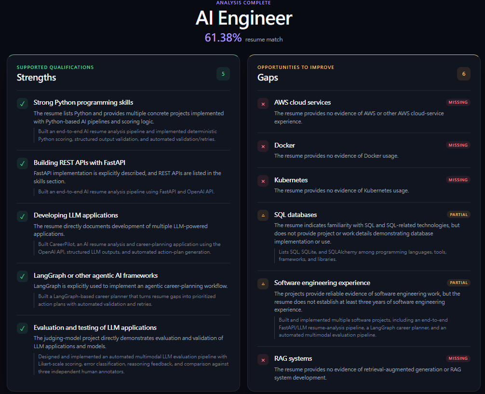
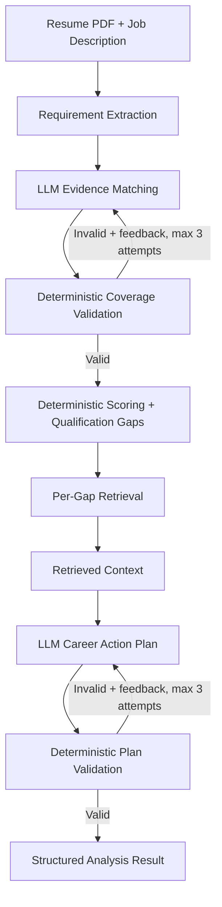
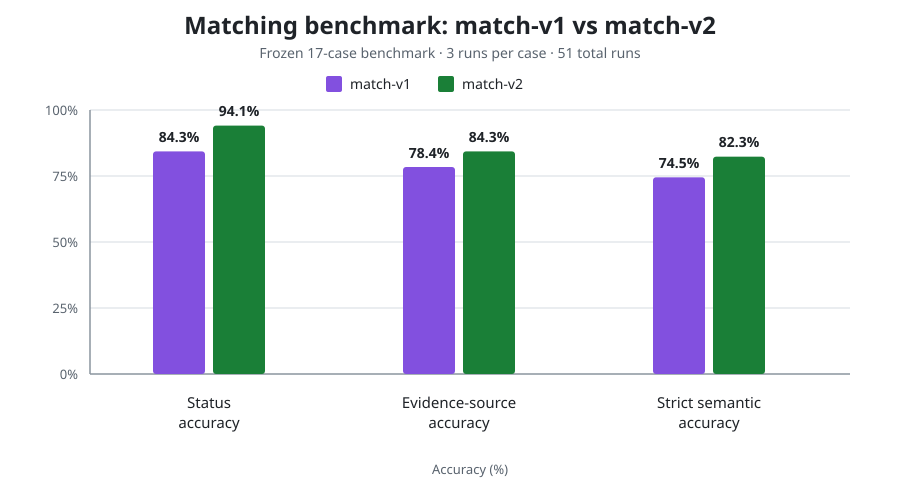

# CareerPilot

CareerPilot is an AI-powered resume-to-job matching application that identifies matched, partial, and missing qualifications, calculates a transparent match score, and turns gaps into an actionable career plan.

- Structured LLM outputs
- Deterministic validation and scoring
- LangGraph-based repair workflows
- Evaluation-driven prompt versioning

## Product preview



## How it works



The LLM handles semantic interpretation and generation. Python owns known rules: requirement coverage, plan validity, retry limits, and weighted scoring. LangGraph coordinates the two validation-and-repair loops without controlling the entire analysis pipeline.

## Measured reliability

CareerPilot uses a frozen, policy-corrected benchmark of 17 matching cases, evaluated three times per case (51 runs). It is a project regression benchmark—not a claim of general resume-matching accuracy.

| Metric | match-v1 | match-v2 |
| --- | ---: | ---: |
| Structural coverage pass@1 | 100.0% | 100.0% |
| Status accuracy | 84.3% | 94.1% |
| Evidence-source accuracy | 78.4% | 84.3% |
| Strict semantic accuracy | 74.5% | 82.3% |



The model remained `gpt-5.6-luna`, and the dataset, scoring, deterministic validation, retry policy, and LangGraph behavior remained unchanged. The improvement came from the versioned `match-v2` evidence-policy prompt, which distinguishes evidence of the required capability from merely related or transferable experience.

Frozen results: [match-v1](backend/evals/results/match-v1-baseline.md) · [match-v2](backend/evals/results/match-v2-benchmark.md)

## Engineering highlights

- Pydantic schemas constrain requirement, matching, and planning outputs.
- Deterministic validation requires every extracted requirement exactly once.
- Validation feedback drives bounded repair attempts through LangGraph.
- Python calculates the weighted score; the model never invents a percentage.
- Versioned prompts and a regression suite make semantic changes measurable.
- RAG-grounded planning indexes Markdown with deterministic heading-aware, overlapping chunks, stores their embeddings in SQLite, and retrieves semantic Top-K context from deterministic gap queries using cosine similarity.
- Retrieved knowledge informs plan generation without becoming candidate resume evidence; retrieval fails open to the original planner behavior.

## Tech stack

| Layer | Technologies |
| --- | --- |
| Backend | Python, FastAPI, Pydantic, SQLAlchemy |
| AI workflow | OpenAI API, LangGraph, RAG |
| Frontend | React, TypeScript, Vite |
| Storage and documents | SQLite, Markdown, pypdf |
| Quality | pytest, frozen matching evaluations |

## Run locally

From the repository root, create an `.env` file:

```env
OPENAI_API_KEY=your_api_key
```

Start the backend:

```bash
python -m venv .venv
# Activate .venv for your shell
pip install fastapi uvicorn sqlalchemy pydantic python-multipart pypdf openai python-dotenv langgraph pytest
uvicorn backend.main:app --reload
```

In another terminal, start the frontend:

```bash
cd frontend
npm install
npm run dev
```

Open `http://localhost:5173`, upload a PDF resume, paste a job description, and run the analysis. FastAPI is available at `http://localhost:8000/docs`.

## Design principle

LLM output can be flexible; system behavior should still be measurable. CareerPilot keeps semantic judgment with the model while enforcing application rules with deterministic code and regression benchmarks.
